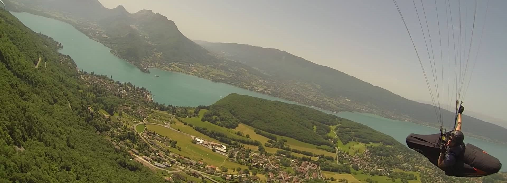
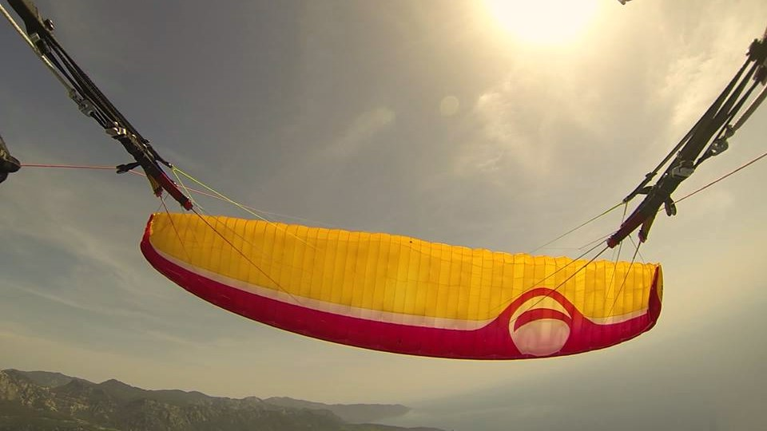

<h1 align="center">Dave Martin</h1>

# Preflight
Preflight - a paragliding flight planning tool.

Preflight is currently at early design stage and is intended as a tool to assist pilots in coordinating their flight plans and general logistics around cross-country flight planning

## Planned features
- matches users with other pilots likely to be flying from the same launch site, 
- assists in recognition of other pilots both in the air and on the ground, 
- eases coordination of transport to launch and pickups after landing. 
- simplifies submission of [CANP](https://www.bhpa.co.uk/documents/safety/canp/) reports to reduce the chances of conflict with military air traffic.
- eases the sharing of electronic conspicuity details.
- flight logging and replay.
- Integration of [RASP](http://rasp.stratus.org.uk/index.php/rasptable-desktop), Leonardo, [XC Contest](https://www.xcontest.org/world/en/) and [Ayvri](https://ayvri.com/)

